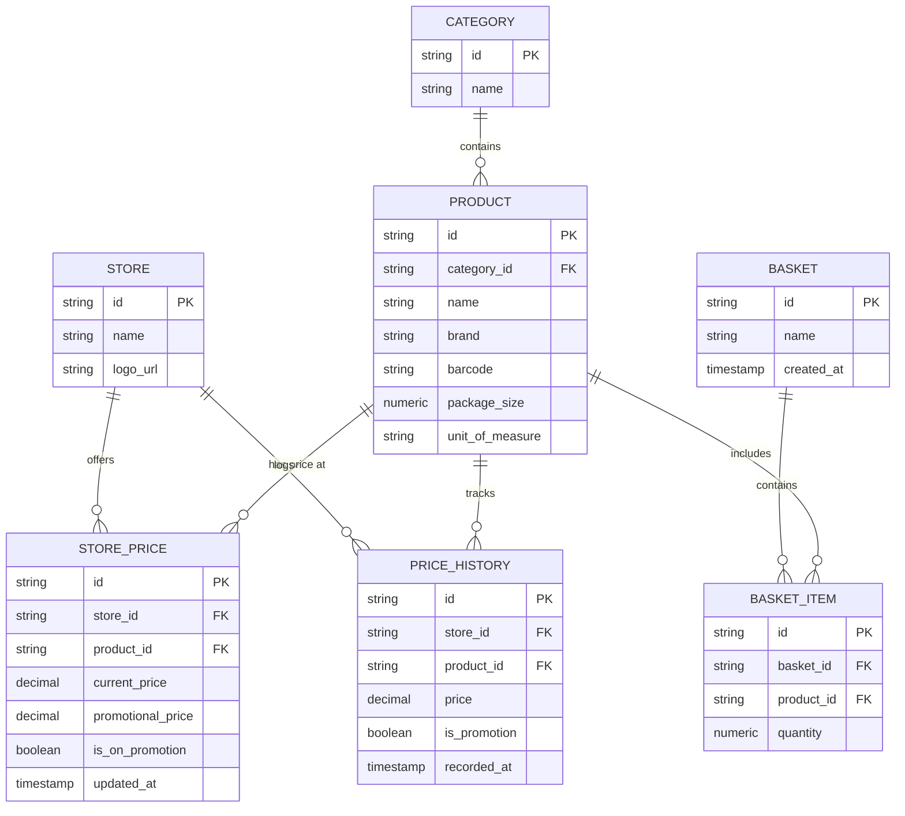

# Smart Basket — Conceptual Domain Model & Entity Relationships

This document outlines the core domain entities, data attributes, integrity rules, and relationships for the Smart Basket platform.

---

## 1. Simplified Conceptual Entities

### 1. Store (Supermarket Chain)
Represents the brand/chain being compared.
- **Attributes:**
  - `id`: Unique identifier
  - `name`: Store/brand name (e.g., *Checkers*, *Pick n Pay*, *Woolworths*)
  - `logo_url`: URL path to store logo
- **Purpose:** The single source of pricing for that brand.

### 2. Category
Organizes products into high-level groupings.
- **Attributes:**
  - `id`: Unique identifier
  - `name`: Category label (e.g., *Dairy*, *Bakery*, *Pantry*)

### 3. Product (Universal Item)
Represents the physical grocery item regardless of where it is sold.
- **Attributes:**
  - `id`: Unique identifier
  - `category_id`: Foreign key reference to Category
  - `name`: Product title (e.g., *"Full Cream Fresh Milk"*)
  - `brand`: Brand name (e.g., *"Clover"*)
  - `barcode`: Universal product code / EAN-13 barcode, where available
  - `package_size`: Numeric quantity (e.g., `2`)
  - `unit_of_measure`: Base measurement unit (e.g., `L`, `kg`, `g`, `ml`, `unit`)

### 4. StorePrice (Current Chain Price)
Links a specific universal product to a store chain and records its active price.
- **Attributes:**
  - `id`: Unique identifier
  - `store_id`: Foreign key reference to Store
  - `product_id`: Foreign key reference to Product
  - `current_price`: Decimal / numeric active selling price
  - `promotional_price`: Nullable decimal / numeric discount price
  - `is_on_promotion`: Boolean flag indicating promotion status
  - `updated_at`: Timestamp of latest price sync
- **Rule:** A unique constraint on `(store_id, product_id)` ensures each store chain maintains exactly one active price record per product.

### 5. PriceHistory (Time-Series Log)
Records historical price movements for tracking trends across chains over time.
- **Attributes:**
  - `id`: Unique identifier
  - `store_id`: Foreign key reference to Store
  - `product_id`: Foreign key reference to Product
  - `price`: Decimal / numeric recorded price point
  - `is_promotion`: Boolean flag indicating if price was promotional
  - `recorded_at`: Timestamp of price observation

### 6. Basket & BasketItem (User List)
Enables shoppers to build custom grocery baskets for multi-store evaluation.
- **Basket Attributes:**
  - `id`: Unique identifier
  - `name`: User-facing basket name (e.g., *"Weekly Shop"*)
  - `created_at`: Creation timestamp
- **BasketItem Attributes:**
  - `id`: Unique identifier
  - `basket_id`: Foreign key reference to Basket
  - `product_id`: Foreign key reference to Product
  - `quantity`: Numeric quantity required

---

## 2. Streamlined Entity Relationships

| From Entity | Relationship | To Entity | Description |
| :--- | :---: | :--- | :--- |
| **Category** | `1 : N` | **Product** | One category contains many products. |
| **Product** | `1 : N` | **StorePrice** | One product has a price entry at each store chain. |
| **Store** | `1 : N` | **StorePrice** | One store chain lists current prices for many products. |
| **Store / Product** | `1 : N` | **PriceHistory** | Tracks price shifts for that product at that store over time. |
| **Basket** | `1 : N` | **BasketItem** | A user basket contains multiple products and quantities. |

---

## 3. Entity Relationship Diagram (ERD)

